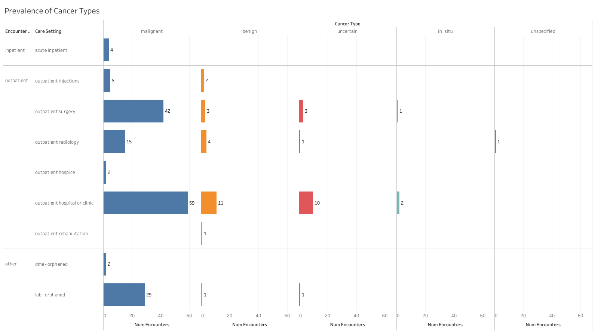
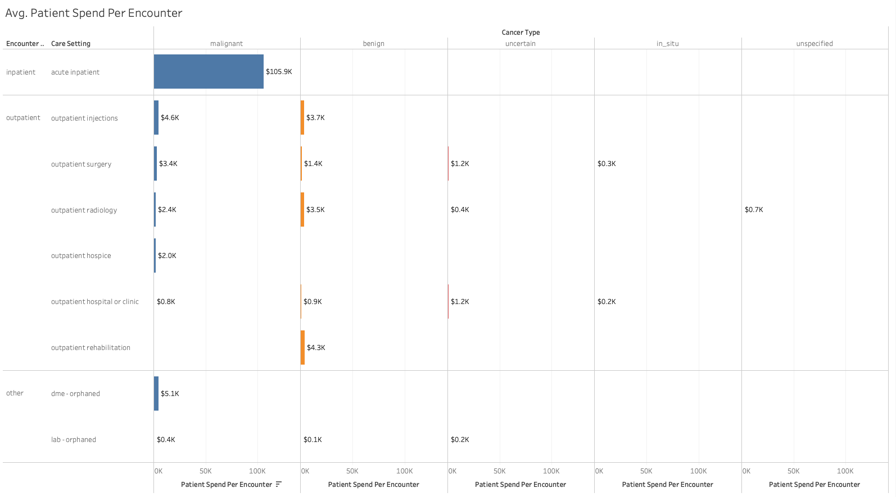

# Methodology 
Cancer Cohort Definition
* In the ICD-10 reference provided, I was able to find a table that broke down various cancers by type.
    * All cancers fall between the range of C00-D49. Started with a regex approach but decided to create a seed file instead for easier readability and maintenance.
* I decided to filter claims for using these codes to generate the cohort of cancer patients.
* I created a few fact and dim mart with additional fields such as location_id and encounter dates. 
    * These would be helpful for future deeper explorations into facilities, regions, and change over time.

# Key Findings  

* In the sample provided, the most prevalent cancers were malignant types that required outpatient surgery 

* However, the most expensive encounters by far were malignant types that required inpatient care

### AI Usage Log
* Used ChatGPT instead of trawling through StackOverflow for debugging.
* I enjoy practicing + writing regex by hand to maintain proficiency, so I do not use AI for that, yet.
